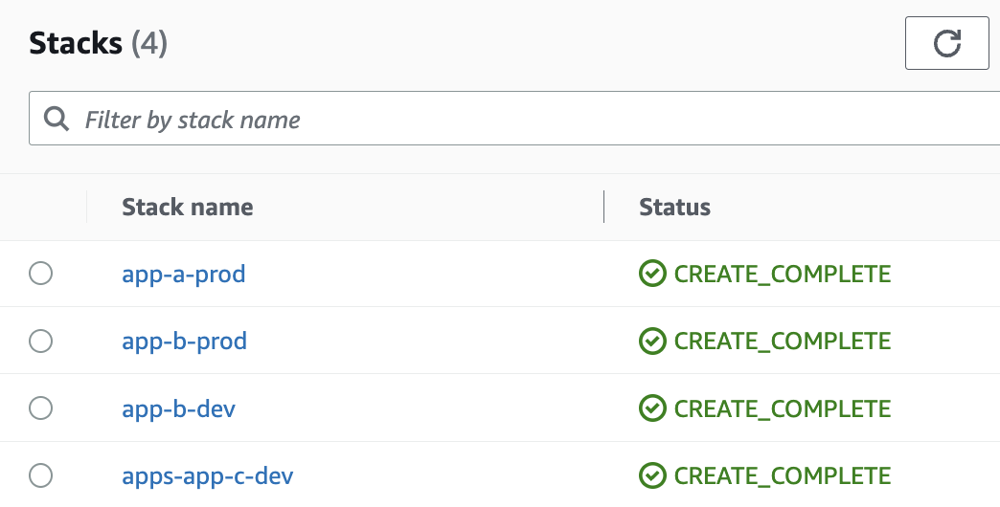
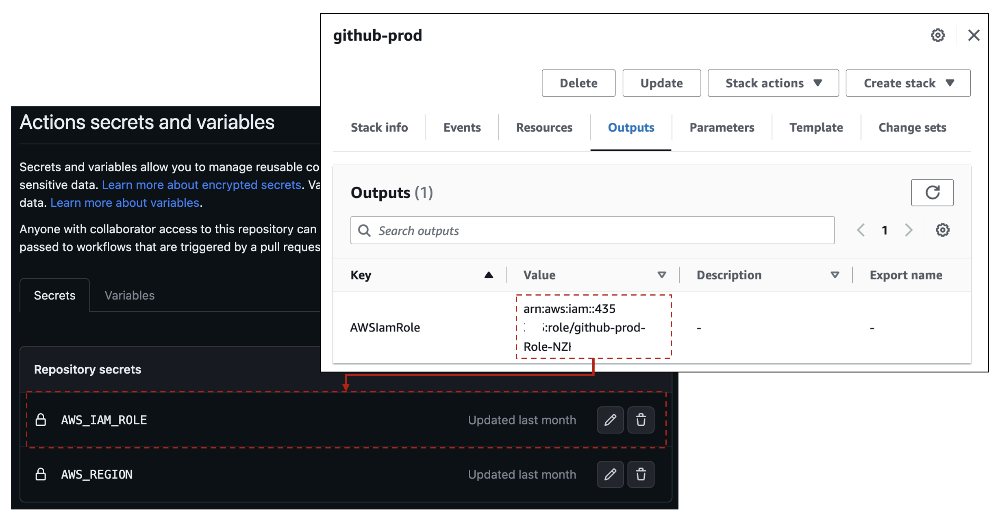
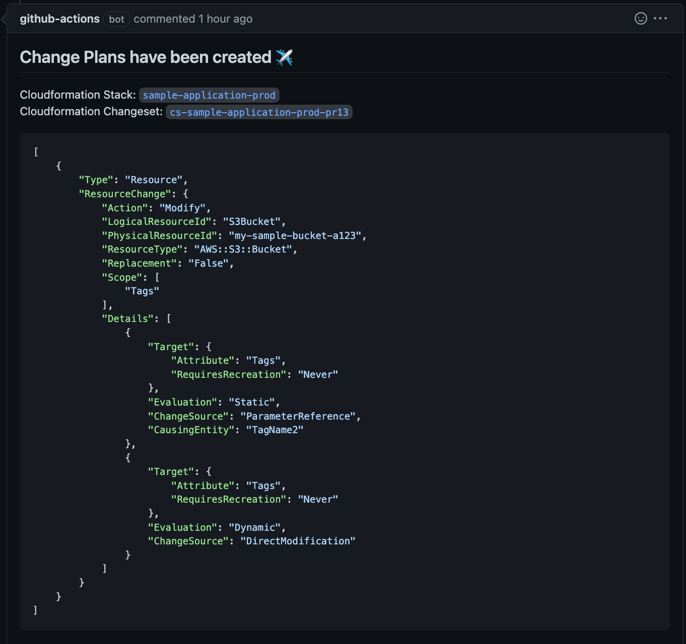
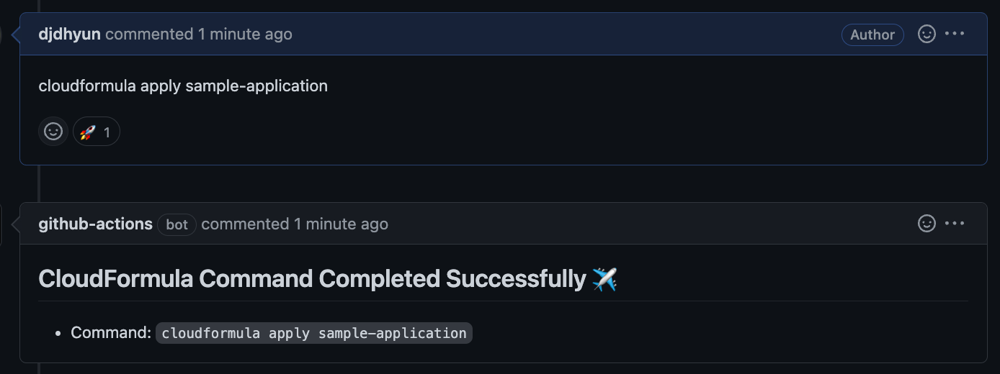
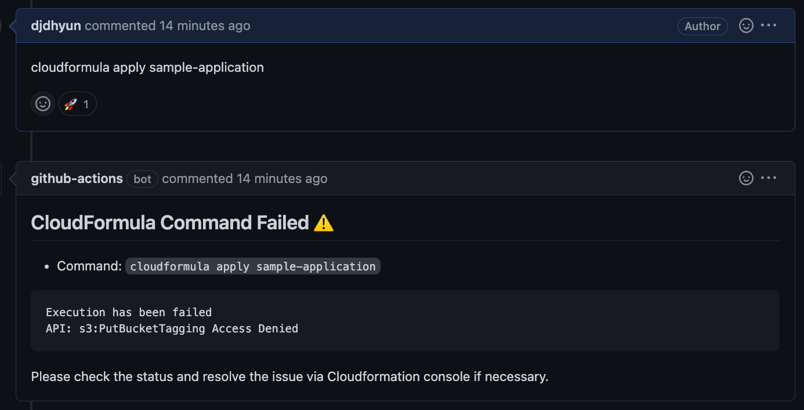

# CloudFormation Stacks as a code

`CloudFormula` is a tool that makes AWS Cloudformation simpler to use in local machines as well as within github pull requests.

## Prerequisite

* `aws-cli` w/ a configuration as an authorized user.
* You should activate an AWS profile by either exporting `AWS_DEFAULT_PROFILE` or setting a default profile by `aws configure`.
* `cfn-lint`
    * `brew install cfn-lint` (for mac users only)
    * `pip install cfn-lint`
        * For further information, please refer to [this post](https://www.techielass.com/install-cfn-lint-on-windows)


## Cloudformation Stack Directories

* A stack directory is where you have a `main.yaml` and properties files.
    * `main.yaml`: A Cloudformation template that defines all resources for the stack.
    * `${env}.properties`: Parameters to be applied to the template for the target environment.
* For example, if you have a directory structure as below, you will have 3 cloudformation directories as `app-a, app-b, apps/app-c`.

```bash
├── Makefile
├── README.md
├── cloudfomula
├── app-a
│   ├── main.yaml
│   └── prod.properties
├── app-b
│   ├── main.yaml
│   ├── prod.properties
│   └── dev.properties
└── apps
   └── app-c
       ├── main.yaml
       └── dev.properties
```

* Each directory name corresponds with each CloudFormation stack. The actual stack name will be in the form of `${stack_directory_name}-${properties_file_name}`
* The stack name will be the whole directory path if you have a nested directory as a stack directory. OS separator('/') will be replaced with '-'.
* Stack directory names must satisfy regular expression pattern `[a-zA-Z][-a-zA-Z0-9]`
* If you have deployed all cloudformation stacks declared in the directory structure above, you will have the following stacks deployed.
 


## Setup your repository

### 1. Create your own github repository.

* Click `Use this template` and `Create a new repository` buttons.
* Determine `Owner` and `Repository name`.
* Don't forget to make it private if you want to keep your aws resources secure.

### 2. Prepare a cloudformation directory for github bot.

* This repo provides a sample stack directory ([github directory](github)) for this. Please refer to [aws-actions/configure-aws-credentials](https://github.com/aws-actions/configure-aws-credentials#usage) for the background knowledge.
* Replace the parameters of [github/prod.properties](github/prod.properties) with your repository name and owner.
* In this repo, github bot is only authorized for S3 to represent a sample use case. You can check [github/main.yaml](github/main.yaml#L40-L58) to find out how it is configured and you can revise this part as you want. The scope of authority granted to github bot is entirely your decision considering how far you want to maintain aws resources by gitops. To put it to the extreme, if you don't care about the AWS IAM rule of granting least privilege and don't want to be bothered in the future, you can simply grant the administrator role to github bot.

### 3. Authorize your github bot to access aws.

* Once your template is ready, you can run this command to apply it. 
    * `./cloudformula plan github prod cli && ./cloudformula apply github prod cli`
* This will create a new Cloudformation stack named `github-prod`.

### 4. Register github action secrets.

* `AWS_IAM_ROLE`: output value of `AWSIamRole` in `github-prod` stack.
* `AWS_REGION`: aws region name where you resource resides. (e.g. us-west-2)



## GitOps Scenario

### 1. Make Change Plans



* Once you create a pull request, corresponding changesets are going to be created by github action automatically.
* If there are multiple stacks to be changed, it will show all changesets by posting each comments.
* Whenever the pr is synchronized (i.e. any new commit is added to the pr), it will discard the previous changeset and recreate one. And let you know about the new changesets by posting new comments.
* You can directly move to Cloudformation console by clicking any link of "Cloudformation Stack & Changeset" part. You can apply the changeset right away by clicking the apply button in the webpage if you want.
* You can also create a plan for a specific stack by your own by posting a comment with "cloudformula plan ${stack\_directory\_name}"

### 2. Apply Change Plans



* Write a comment: cloudformula apply ${stack\_directory\_name}
* A 🚀 reaction means that the command has been successfully triggered, so you are good to wait for a while.
* If the plan has been applied successfully, it will show a brief message with a comment. 
* If you have applied all changsets for the pull request, it means that you are good to merge the pull request!

### 3. If Plan Apply fails



* It will breifly inform you the reason why you failed.
* If you feel lack of information, you can move to Cloudformation console by clicking the links provided by the previous `plan` comment.
* One of the common causes is that the github bot doesn't have enough authority to control the aws resources. If so, you should grant it by your own before resuming to apply the changeset. Refer to [github/main.yaml](#2-prepare-a-cloudformation-directory-for-github-bot) for the guidelines.
* Once you resolve the issue, you can add another commit to the pr or close and reopen the pr to recreate changesets. Try to apply them again when you're ready.

### 4. End of the PR

* Once you close the pull request (either merged or not), it will cleanup the remaining changesets if there still exist.


## Use `cloudformula` in your local machines

### Run `cloudfomula`

* Disclaimer: `cloudfomula` works properly on Mac for sure, but Windows has not been tested as of yet.
* Common usage: `./cloudfomula $subcommand $templatedir $env $suffix`
    * `$suffix` simply works as an identifier of your changeset. It can be any value you prefer, but cannot be omitted.
    * e.g. `./cloudfomula plan sample-application prod my-suffix`
* Subcommands
    * `plan`: Create a changeset for given template file and properties.
    * `url`: Get an url where you can access the changeset in Cloudformation console.
    * `apply`: Apply the changeset.
    * `abort`: Destroy the changeset created via `plan` command.
    * `describe`: Describe the changeset.
    * `arn`: Get ARN of the changeset.
    

