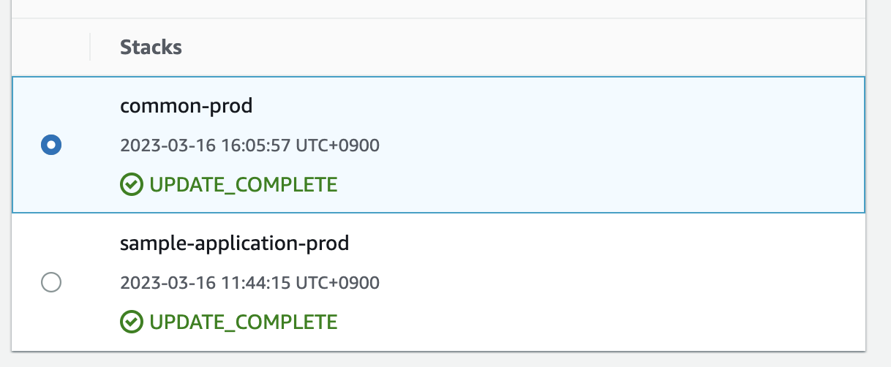

# CloudFormation Stacks as a code

## Prerequisite

* `aws-cli` w/ a configuration as an authorized user.
* `cfn-lint`
    * `brew install cfn-lint` (for mac users only)
    * `pip install cfn-lint`
        * For further information, please refer to [this post](https://www.techielass.com/install-cfn-lint-on-windows)

## Directory Structure

```bash
├── Makefile
├── README.md
├── cloudfomula
├── common
│   ├── main.yaml
│   └── prod.properties
├── sample-application
│   ├── main.yaml
│   └── prod.properties
└── your-another-application
    ├── main.yaml
    ├── dev.properties
    └── prod.properties
```



* Each directory names corresponds with each CloudFormation stacks. The actual stack name is composed of `${stack_directory_name}-${properties_file_name}`
* `main.yaml`: A Cloudformation template that Defines all resources for the stack.
* `${env}.properties`: Parameters to be applied to the template for the target environment.

## GitOps Scenario

### 0. Beforehand, Authorize your github bot to access aws.

* You can also take advantage of this repo as well to do so. 
* Please refer to [aws-actions/configure-aws-credentials](https://github.com/aws-actions/configure-aws-credentials#usage) and how the [github](github) is defined within a cloudformation template. 
* Once your template is ready, you can use these command to apply it.
    * `./cloudformula plan github prod`
    * `./cloudformula apply github prod`
* Further information about `cloudformula` will be continued in the following section

### 1. Make Change Plans


* Once you create a pull request, corresponding changesets are going to be created by github action automatically.
* If there are multiple stacks to be changed, it will show all changesets by posting each comments.
* Whenever the pr is synchronized (i.e. any new commit is added to the pr), it will discard the previous changeset and recreate one. And let you know about the new changesets by posting new comments.
* You can directly move to Cloudformation console by clicking any link of "Cloudformation Stack & Changeset" part.
* You can also create a plan for a specific stack by your own by writing a comment with "cloudformula plan ${stack\_directory\_name}"

### 2. Apply Change Plans


* Write a comment: cloudformula apply ${stack\_directory\_name}
* A 🚀 reaction means that the command has been successfully triggered, so you are good to wait for a while.
* If the plan has been applied successfully, it will show a brief message with a comment. 
* If you have applied all changsets for the pull request, it means that you are good to merge the pull request!


### 3. If Plan Apply fails


* It will breifly inform you the reason why you failed.
* If you feel lack of information, you can move to Cloudformation console by clicking the links provided by the previous `plan` comment.
* One of the common causes is that the github bot doesn't have enough authority to control the aws resources. If so, you should grant it by your own before resuming to apply the changeset.
* Once you resolve the issue, you can add another commit to the pr to recreate changeset, or add a comment with "cloudformula plan ${stack\_directory\_name}". Try to apply it again when you're ready.

### 4. End of the PR

* Once you close the pull request (either merged or not), it will cleanup the remaining changesets if there still exist.


## Ops within your local env

### Run make command

* `make lint`: Run linter on all Cloudformation template files.
* `STACK=${STACK_NAME} make plan`: Create necessary changesets for given stacks
    * e.g. `STACK=sample-application make plan`
* `make apply`: Apply the changesets created via `make plan`
* `make abort`: Abort and remove changesets created via `make plan`

### Run `cloudfomula`

* Common usage: `./cloudfomula $subcommand $templatedir $env`
* e.g. `./cloudfomula plan sample-application prod`
* Subcommands
    * `plan`: Create a changeset for given template file and properties.
    * `abort`: Destroy the changeset created via `plan` command.
    * `describe`: Describe the changeset.
    * `apply`: Apply the changeset.
    * `arn`: Get ARN of the changeset.
    * `url`: Get an url where you can access the changeset in Cloudformation console.

### Or you can use aws-cli directly to do the same things like below.

```sh
aws cloudformation create-change-set \
    --template-body file://sample-application/main.yaml \
    --parameters file://sample-application/prod.properties" \
    --stack-name sample-application-prod \
    --capabilities CAPABILITY_NAMED_IAM

aws cloudformation execute-change-set ...
```
